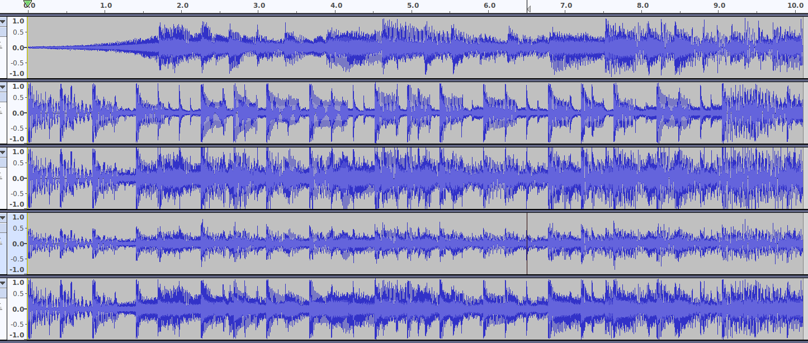

# 声音合并与交叉

## 两个示例
原音频
```
bensound-creativeminds_10s.wav
bensound-summer_10s.wav
```
合并与交叉后的音频
- 两个音频的合并
```
combine_sound.wav
```
- 两个音频的交叉 
```
cross_sound.wav
```

## waveform对比
下图的5个声音waveform对应如下生成的5个文件
```
bensound-creativeminds_10s.wav
bensound-summer_10s.wav
combined.wav
combine_sound.wav
cross_sound.wav
```
